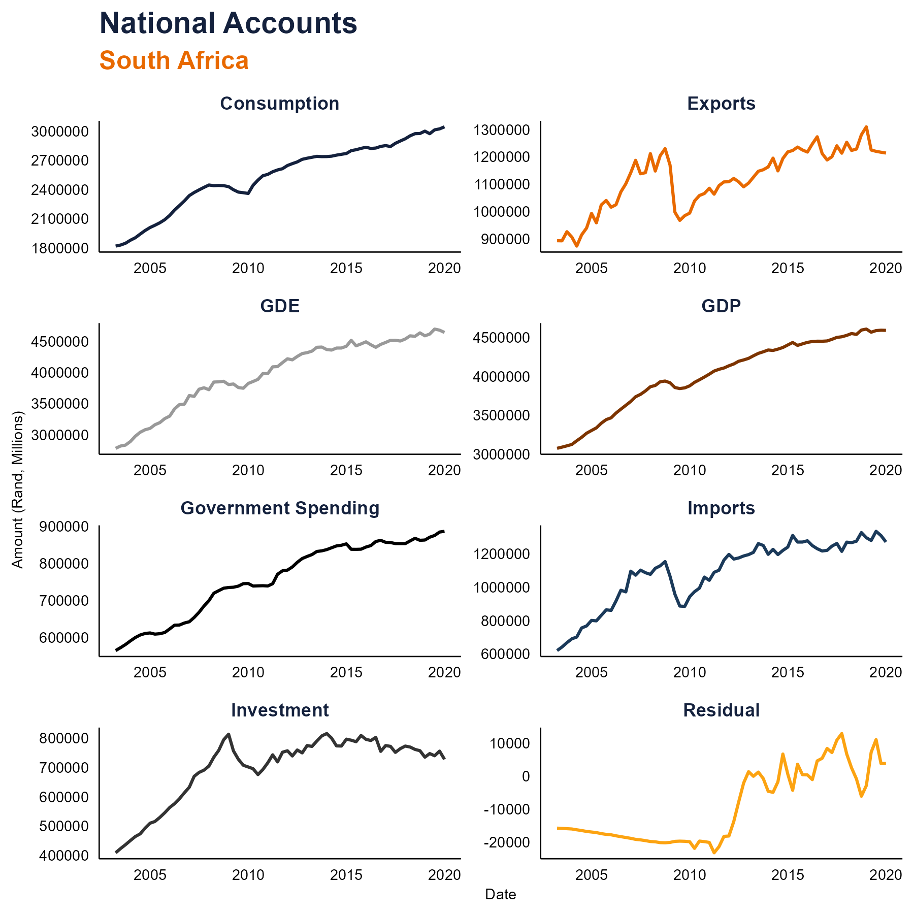
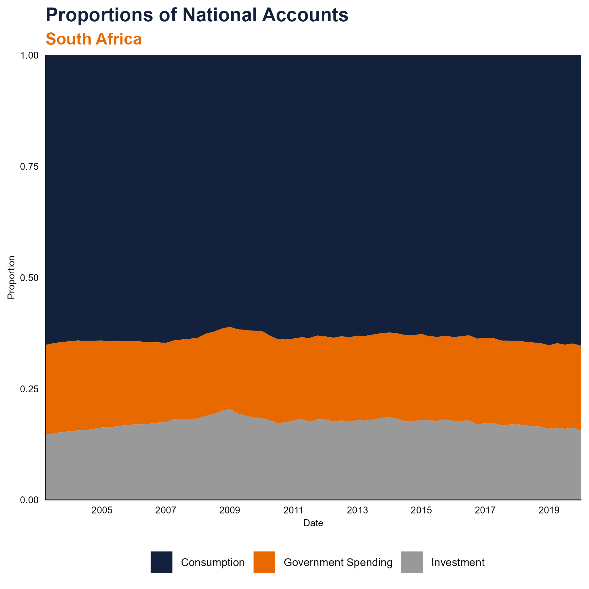

```{r packages, include=FALSE}

library(tidyverse)
library(econdatar)
library(lubridate)
library(scales)
library(ggrepel)
library(tibbletime)
library(readxl)
library(lemon) 
library(tseries)
library(forecast)
library(stargazer)
library(gridExtra)
library(tinytex)
library(kableExtra)

```


\newpage 

# Introduction

This exercise sets out to retreive, clean and plot National Accounts Data for South Africa.

Four files are included in the code folder:

- reading_econdata.R uses the EconData portal by Codera [https://www.econdata.co.za](see here for more) to read in data as well as an excel document in the data folder. The framework is provided by econdata, however, it provides the data as a large list, however, I have written the function to convert the data to a data frame. 

- graph_theme.R specifies colours and some preferences for graphing. These are some of my graphing preferences that I found myself using when making graphs (minimalist, very clean), so it has just been written as a theme I can call on when needed. A colour scheme is also specified here.

- data_wrangling.R joins the national accounts data to the inflation data, and performs some operations:
  - Convert the inflation data from monthly to quarterly
  - Calculates annual growth rates
  - Calculates the proportions that Consumption, Government Spending, Investment and Net Exports contribute to GDP.

- graphing.R plots this data, and the plots are imported and shown below.

(Please note, my .Renviron file contains my login credentials to Econdata that makes this run but that document has been placed in the gitignore)

Running the following code to ensure the data and graphs are up to date with the latest dat: 

```{r}

source("~/GitHub/sample_code/code/reading_econdata.R")
source("~/GitHub/sample_code/code/graph_theme.R")
source("~/GitHub/sample_code/code/data_wrangling.R")
source("~/GitHub/sample_code/code/graphing.R")

```

# National Accounts

Here is a snapshot of the National Accounts Data
```{r}



```

Final Household Consumption, Government Spending and Fixed Private Investment growth rates are shown next, then in the second graph, GDP is superimposed to graphically assess the sensitivity of GDP to spikes in its core components.

```{r}


```


```{r}



```

```{r}


```


\newpage

# Conclusion